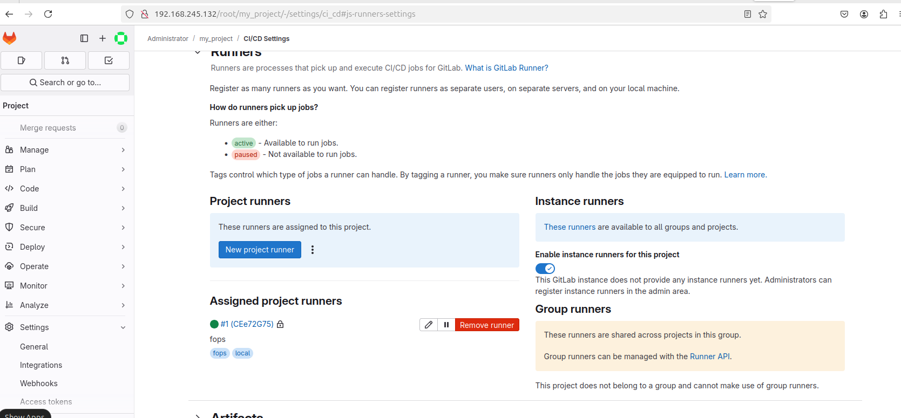
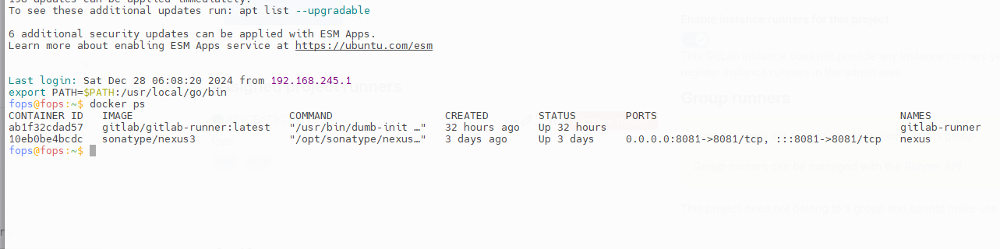
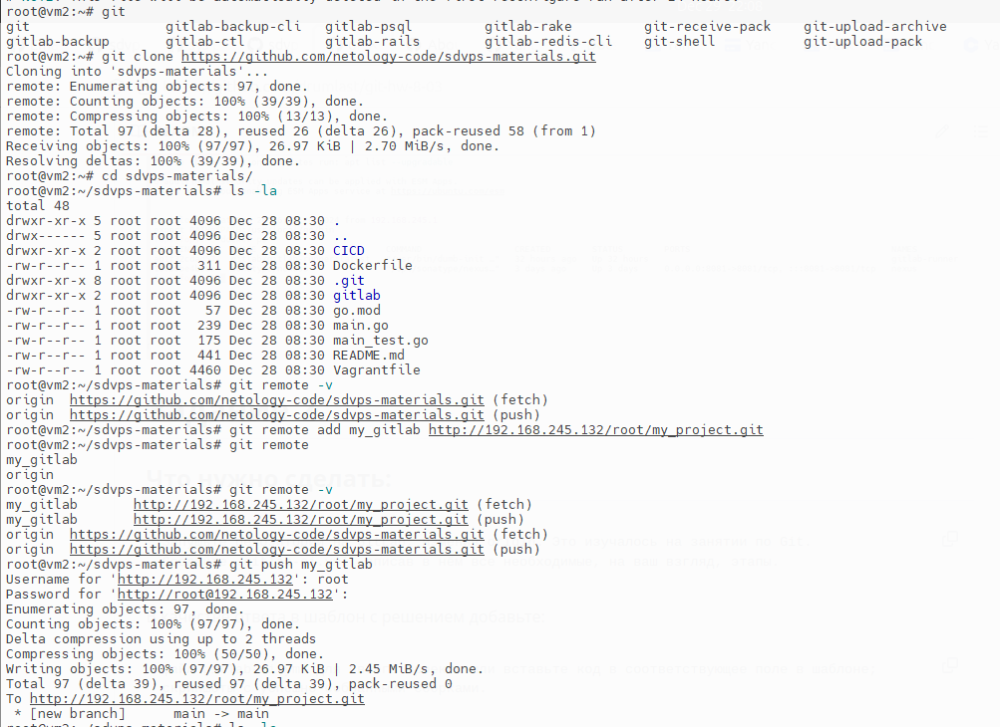
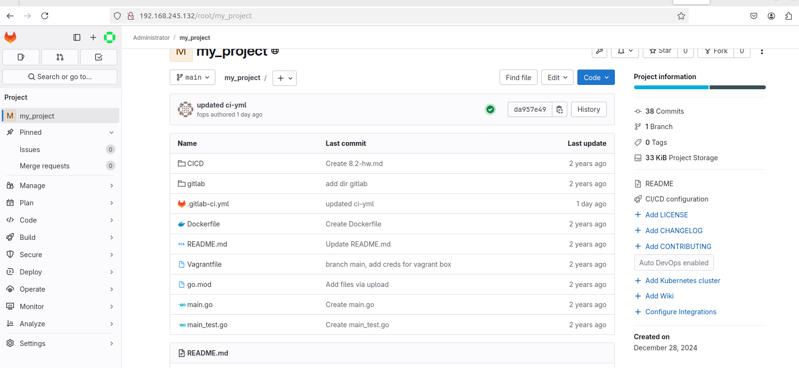
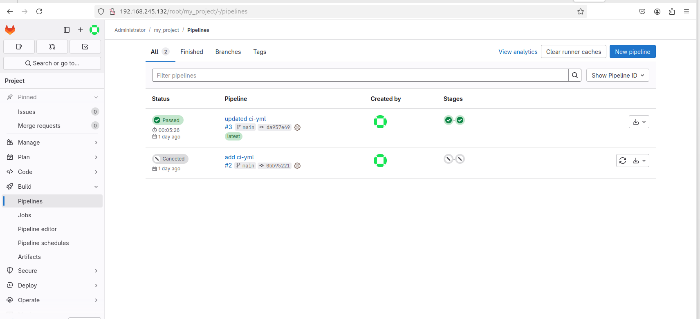

# Задание 1

## Что нужно сделать:

    Разверните GitLab локально, используя Vagrantfile и инструкцию, описанные в этом репозитории.
    Создайте новый проект и пустой репозиторий в нём.
    Зарегистрируйте gitlab-runner для этого проекта и запустите его в режиме Docker. 
    Раннер можно регистрировать и запускать на той же виртуальной машине, на которой запущен GitLab.

В качестве ответа в репозиторий шаблона с решением добавьте скриншоты с настройками раннера в проекте.
#### Раннер в GitLab

#### Раннер в докере

# Задание 2

## Что нужно сделать:

    Запушьте репозиторий на GitLab, изменив origin. Это изучалось на занятии по Git.
    Создайте .gitlab-ci.yml, описав в нём все необходимые, на ваш взгляд, этапы.
#### PUSH и Замена origin

В качестве ответа в шаблон с решением добавьте:

    файл gitlab-ci.yml для своего проекта или вставьте код в соответствующее поле в шаблоне;
    скриншоты с успешно собранными сборками.

